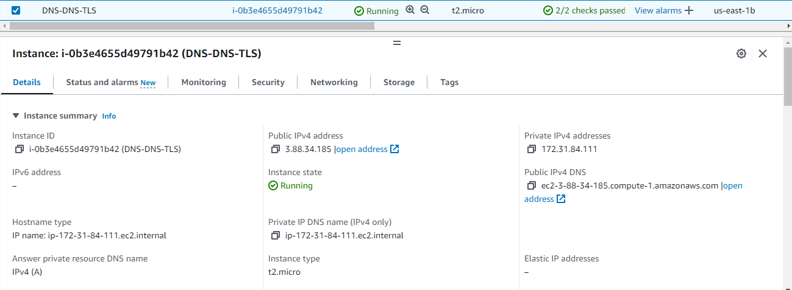

# DNS to DNS-over-TLS proxy

A DNS to DNS-over-TLS proxy acts as an intermediary service that takes standard DNS (Domain Name System) requests from clients and forwards them to a DNS server over a secure TLS (Transport Layer Security) connection.

This setup enhances privacy and security by encrypting the DNS queries, preventing eavesdropping and manipulation by third parties. When a client device makes a DNS request (for example, to resolve a domain name to an IP address), the proxy receives this request, securely communicates with a DNS server using DNS-over-TLS (DoT) to perform the query, and then returns the response to the client.

This way, the proxy enables devices or networks that do not natively support DNS-over-TLS to benefit from the added security of encrypted DNS queries.

## Getting Started

This project implements a DNS-to-DNS-over-TLS proxy server. It encrypts DNS queries using the DNS-over-TLS (DoT) protocol before forwarding them to Cloudflare's 1.0.0.1 DNS service. This ensures enhanced privacy and security by encrypting the traditionally plaintext DNS queries.

## Implementation

### Architecture


### Key Features

- Listens for UDP DNS requests and forwards them securely over TLS.
- Utilizes Cloudflare's 1.0.0.1 DNS service for DNS resolution.
- Handles both `nslookup` and `dig` requests by converting UDP requests to TCP, forwarding them over TLS, and then converting responses back to UDP.
- Designed to run within a Docker container for ease of deployment and isolation.

### Requirements

- Ubuntu Linux VM on AWS
  
  <br>
  
  <br>

- Docker installed on VM.

### Installing and Running

1. **Prepare the Source Code**:
   Ensure the `proxy.py` script & `Dockerfile` are placed in a directory on VM.

2. **Build the Docker Image**:
   Navigate to the directory containing the Dockerfile and run the following command to build your Docker image:

   ```
   sudo docker build -t dns-server .
   ```

This command creates a Docker image named `dns-server` based on the instructions in your Dockerfile.

3. **Create a Docker Network**:
   To ensure the DNS server container can communicate on a specified network, create a Docker network with a custom subnet:

   ```
   sudo docker network create --subnet=172.168.1.0/24 testNetwork
   ```

   This network configuration allows the DNS proxy container to operate on a predictable IP address within the Docker-managed network.

4. **Run the Container**:
   Launch the container using the built image, attaching it to the previously created network:

   ```
   sudo docker run --net testNetwork --ip 172.168.1.2 -d dns-server
   ```

   This command runs the DNS server in the background. The `--ip` flag assigns a static IP address to the container, matching the expected configuration.

   Verify the `dns-server` container has been assigned to the correct network:

   ```
   sudo docker network inspect testNetwork
   ```

   

5. **Configure DNS Resolution**:
   To use the proxy for DNS queries, configure your VM to use the Docker container's IP address as the DNS server:

   - Edit `/etc/resolv.conf` (Linux) or the equivalent DNS settings on your system, adding:
     ```
     nameserver 172.168.1.2
     ```
   - This directs DNS queries to the proxy server running in the Docker container.

6. **Test the Configuration**:
   Perform DNS lookups to verify the setup:

   ```
   nslookup yahoo.com
   dig @172.168.1.2 -p 53 google.com
   ```

   Successful queries will indicate that the DNS proxy is operational and forwarding queries over DNS-over-TLS to Cloudflare.

   
   <br>
   
   <br>

### Bonus

7. **Test Multiple Incoming requests at the same Time**:
   Execute the `concurrent-request-test.sh` script in the same directory:

   make script executable & run script:

   ```
   sudo chmod +x concurrent-request-test.sh

   ./concurrent-request-test.sh
   ```

## Security Concerns

1. **TLS Security**: Despite TLS's function in safeguarding communications, vulnerabilities may develop as a result of misconfigurations, poor cipher suites, or obsolete TLS versions. It is critical to ensure that the implementation follows current cryptographic techniques and to examine TLS settings on a regular basis in comparison to best practices.

2. **Man-In-The-Middle (MITM) Attacks**: The risk of MITM attacks, where an attacker intercepts and potentially alters communications between the DNS proxy and upstream servers, necessitates a robust validation mechanism for TLS certificates of upstream servers.

3. **Buffer Access and Data Leakage**: When setting up a DNS application that uses DNS over TLS in a live environment, there's a risk that someone could improperly access data stored in memory or a not well-protected cache. This could result in the leaking of sensitive information, like the details of searches made through the DNS.

4. **Dependency Vulnerabilities**: Utilizing open-source libraries like OpenSSL for TLS connections introduces a risk if these dependencies are not kept up-to-date. Regularly updating dependencies and applying security patches is essential.

5. **Denial of Service (DoS) Attacks**: Being a critical piece of infrastructure, the DNS proxy could be targeted by DoS attacks, overwhelming the service with malicious requests. Implementing rate limiting and using DDoS mitigation services can help protect against such threats.

## Integration in a Distributed, Microservices-oriented, and Containerized Architecture

1. **Service Mesh Implementation**: Integrate the DNS proxy as a sidecar proxy within a service mesh architecture. This allows for secure service-to-service communication through mutual TLS (mTLS), enhancing security and facilitating fine-grained control over traffic.

2. **Container Security**: Ensure container security best practices are followed, including using minimal base images, scanning for vulnerabilities, and running containers with the least privilege necessary.

3. **Scalability and Availability**: Deploy the DNS proxy service across multiple nodes in the cluster to ensure high availability. Utilize container orchestration tools like Kubernetes to manage service replicas, handle failover, and automatically scale the service based on demand.

4. **Monitoring and Logging**: Integrate comprehensive monitoring and logging solutions to track the health, performance, and security of the DNS proxy service. This enables quick identification and resolution of issues.

5. **Configuration Management**: Use configuration management tools to automate the deployment and configuration of the DNS proxy service, ensuring consistent and secure configurations across environments.

## Additional Improvements

1. **DNS Query Caching**: Implement an intelligent caching mechanism to reduce latency and improve the efficiency of DNS resolutions. This requires a carefully designed cache invalidation strategy to ensure the accuracy of DNS responses.

2. **Advanced Threat Detection**: Integrate the DNS proxy with threat intelligence services to identify and block requests to known malicious domains, enhancing the overall security posture.

3. **Health Checks and Auto-recovery**: Implement health checks and auto-recovery mechanisms to ensure the DNS proxy service can automatically recover from failures without human intervention.

4. **Traffic Analysis and Anomaly Detection**: Utilize machine learning algorithms to analyze traffic patterns and detect anomalies that could indicate security threats or operational issues.

5. **API for Management and Metrics**: Develop an API that allows for the dynamic management of the DNS proxy and provides access to real-time metrics and logs. This can facilitate integration with existing DevOps tools and processes.
